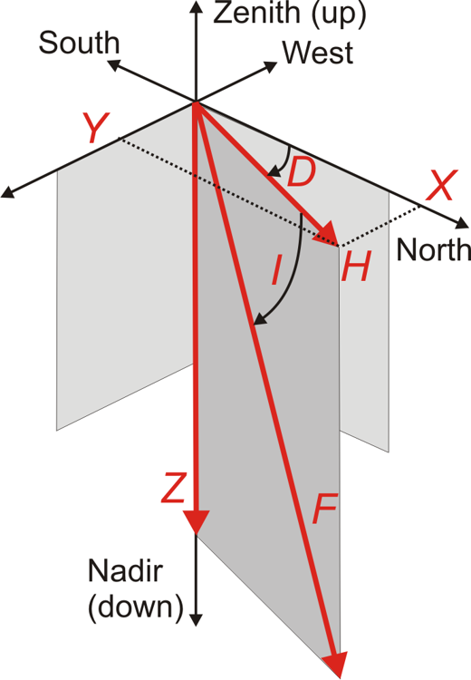

.. _proc_dat_gc:

Geomagnetic Components (or Elements)
------------------------------------
Geomagnetic data can be described in a number of different
orientations. Component codes are used to describe the
individual elements of the geomagnetic vector.

-  X = H*cos(D)
-  Y = H*sin(D)
-  Z = F*sin(I)
-  H = F*cos(I)
-  H = SQRT(X^2 + Y^2)
-  F = SQRT(X^2 + Y^2 + Z^2)
-  tan(D) = Y/X
-  tan(I) = Z/H

    Geomagnetic components

.. tabularcolumns:: |p{1cm}|p{10cm}|

.. table::
    :widths: auto
    :align: center

    +------+--------------------------------------------------------------+
    | Code | Description                                                  |
    +======+==============================================================+
    | X    | North Component. The strength of the magnetic field vector   |
    |      | in the geographic north direction (northerly values are      |
    |      | positive).                                                   |
    +------+--------------------------------------------------------------+
    | Y    | East component. The strength of the magnetic field vector in |
    |      | the geographic east direction (easterly values are           |
    |      | positive).                                                   |
    +------+--------------------------------------------------------------+
    | Z    | Vertical intensity. The strength of the magnetic field       |
    |      | vector in the vertical direction (Z is positive down and     |
    |      | hence negative south of the geomagnetic equator).            |
    +------+--------------------------------------------------------------+
    | H    | Horizontal intensity. The strength of the magnetic field     |
    |      | vector in the horizontal plane along the magnetic meridian.  |
    +------+--------------------------------------------------------------+
    | D    | Declination or variation. The angle between the magnetic     |
    |      | vector and true north (positive east).                       |
    +------+--------------------------------------------------------------+
    | I    | Inclination. The angle between the magnetic vector and the   |
    |      | horizontal plane, in degrees of arc (positive below the      |
    |      | horizontal).                                                 |
    +------+--------------------------------------------------------------+
    | F    | Total field intensity. The geomagnetic field strength,       |
    |      | calculated from and consistent with XYZ or HDZ field         |
    |      | elements.                                                    |
    +------+--------------------------------------------------------------+

